## 1.基础

#### 导语

这部分基础，主要是回顾，回顾基础，主要是用思维导图回顾，思维导图是大纲，细节是这个文档

https://www.yuque.com/suzhe-khrpe/fyvd2a/khot17xt6cgtbaqd

### 问题：flex中如何让一行换行

flex({ warp:FlexWarp.Wrap})
 {  内容代码
 }

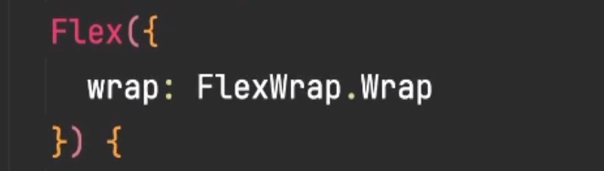

问题：justifyContent的效果

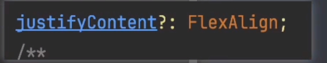

### 1.1组件

##### 1.1.1自定义组件

就是自己定义的struct，在上面写一个@component

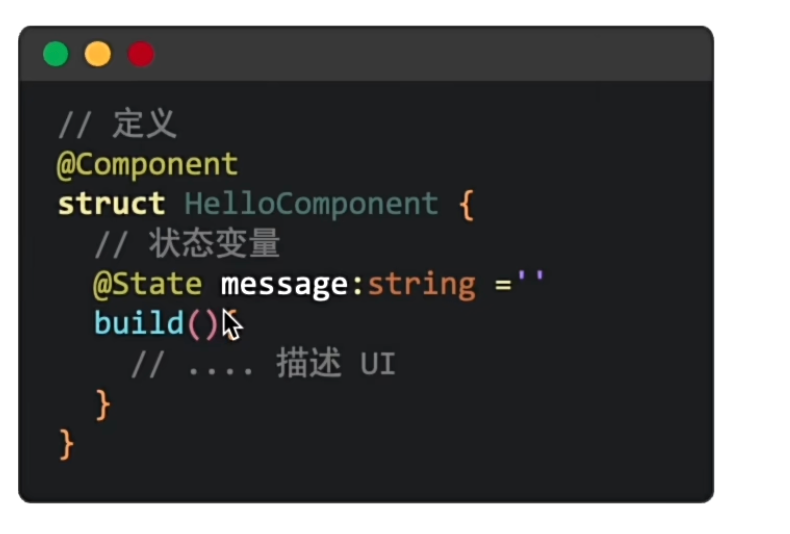

##### 1.1.2系统组件

text

button这样的

##### 1.1.3成员变量和成员函数

思路：一个页面包含两个大致相同的模块，但是模块里面的具体文字不一样，要如何封装

实现：封装一个组件，组件内部有成员变量（可以外部传递参数）至于成员函数，还要在观察一下

~~~javascript
@Component
struct pannl {
  title: string = '我的订单'
  order: string = '全部订单>'
  getChenYanBianLiang = () => {
    AlertDialog.show({
      message: '我是成员变量,'
    })
  }

  getChenYuanHanShu() {
    AlertDialog.show({
      message: '我是成员函数'
    })
  }

  build() {
    Column() {
      Row() {
        //成员变量
        Text(this.title)
        Text(this.order)
          .onClick(() => {
            this.getChenYanBianLiang()
          })
      }.width('100%')
      .justifyContent(FlexAlign.SpaceBetween)
      Row() {
        Text('内容部分')
        Button('成员变量按钮')
          .onClick(() => {
            this.getChenYanBianLiang()
          })
        Button('成员函数按钮')
          .onClick(() => {
            this.getChenYuanHanShu()
          })
      }
    }
    .width('100%')
    .height(120)
    .padding(20)
  }
}

@Entry
@Component
struct ChenYuanBianLiangPage {
  @State message: string = 'sf';

  build() {
    Column() {
      Text(this.message)
        .id('ChenYuanBianLiangPageHelloWorld')
        .fontSize($r('app.float.page_text_font_size'))
        .fontWeight(FontWeight.Bold)
        .alignRules({
          center: { anchor: '__container__', align: VerticalAlign.Center },
          middle: { anchor: '__container__', align: HorizontalAlign.Center }
        })
        .onClick(() => {
          this.message = 'Welcome';
        })
      pannl({
        title: '全部订单', order: '查看全部订单>', getChenYanBianLiang() {
          AlertDialog.show({ message: '已查看全部订单' })
        }
      })
      pannl({
        title: '小米众筹', order: '众筹中。。。>', getChenYanBianLiang() {
          AlertDialog.show({ message: '都说了在众筹中。。。' })
        }
      })
    }
    .height('100%')
    .width('100%')
  }
}
~~~

效果图：点击查看全部订单会触发成员变量的自定义1提示（查看全部订单）。点击众筹中会触发成员变量的自定义2提示（正在众筹中），实现的方法是：使用成员变量

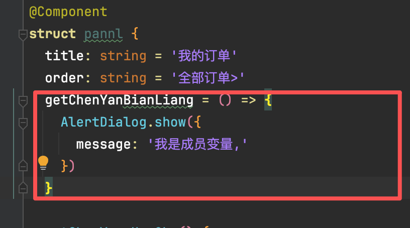

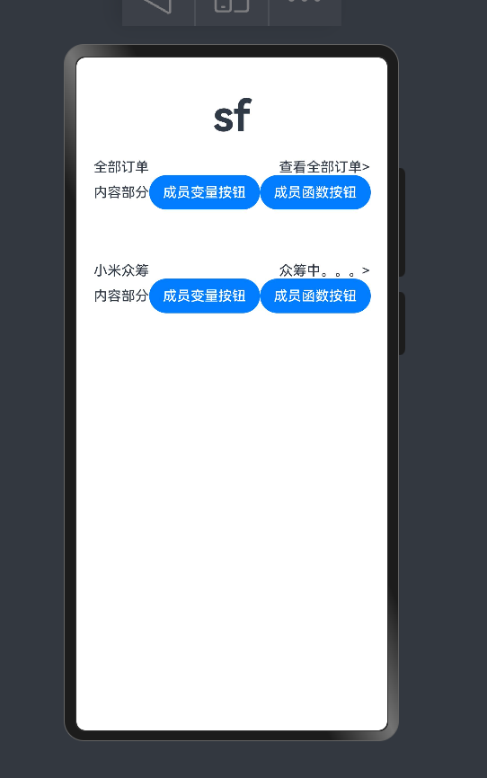

##### 1.1.4@builderParam

def：首先大概就是一个自定义的组件然后之前不是学的builder嘛，那是往组件里面传递参数，现在这个builderParam就是往里面传递结构，比如一个button。这就是一个大概的理解

首先有一个代码模板需要记忆：

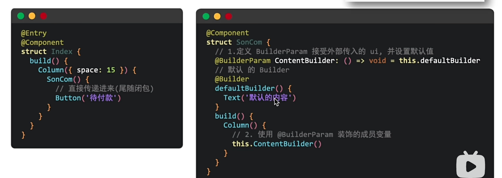

~~~ typescript
//这个demo主要是讲@builderParam的使用方法，功能主要是外面往里面传递结构（传递一个按钮）
//1.至此之前都是正常流程写，到这里就是需要使用那个代码模板
//
@Component
struct sonComp {
  //1。定义builderParam接受外部传入的ui，并设置默认值，如果外部没有传递结构，那就是默认值，如果传递了，就是是使用外面的那个结构
  //2.在build中使用这个结构
  @Builder
  defaultB() { //默认结构
    Button('我是默认的按钮')
  }

  @BuilderParam contentB: () => void = this.defaultB //这就是如果有就传递，没有就默认的结构

  build() {
    Column() {
      this.contentB()
    }
  }
}

@Entry
@Component
struct indexjj {
  build() {
    Column() {
      sonComp()
      //{
      //   //Button('我是外面传递过来的按钮')
      // }
    }
  }
}

~~~

效果就是当我在外面写上button，就显示外面的结构，直接使用儿子组件的话，就是默认的

##### 1.1.5多个@builderParam

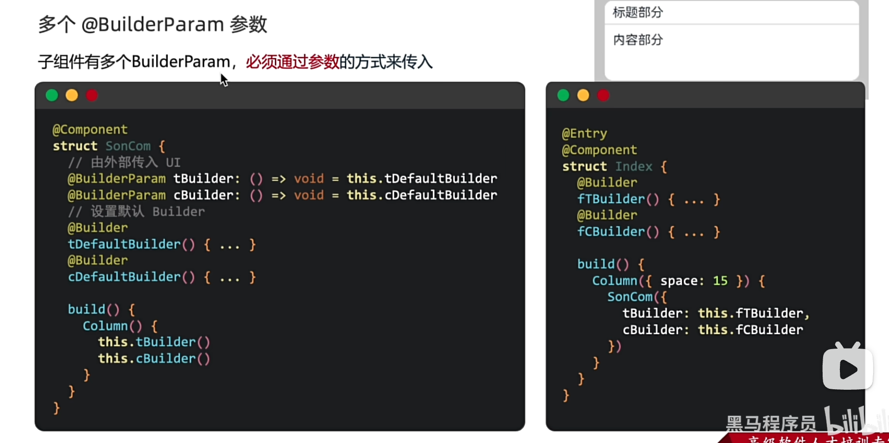

ps【需要特别注意的是，在父组件中使用子组件的builderparam的时候，最后的this.父组件的@builder是不需要加括号的】

~~~ts
//本案例主要是讲多个builderParam的练习

@Component
struct son {
  //@BuilderParam tBuilder: () => void = this.tDefaultBuilder
  @BuilderParam titleBP: () => void = this.titleDefaultBP//上部分bp
  @BuilderParam contentBP:() => void =this.contentDefaultBP
  @Builder titleDefaultBP(){//上部分默认bp
    Text('我是默认上部分标题')
  }
  @Builder contentDefaultBP(){//下部分的默认bp
    Text('我是默认下部分内容')
  }

  build() {
    Column(){
      Column(){
        this.titleBP()//上层标题部分
      }.backgroundColor(Color.Red).width('100%').height(30).margin(5)
      Column(){
        this.contentBP()//下层内容部分
      }.backgroundColor(Color.Blue).width('100%').height(30).margin(5)
    }.padding(5)
  }
}

@Entry
@Component
struct demo {
  @Builder fatherTile(){
    Text('我是传入的大标题')
  }
  @Builder fatherContent(){
    Text('我是传入的大内容')
  }
  build() {
    Column(){
      son()
      son({
        titleBP: this.fatherTile,
        contentBP: this.fatherContent//这里不能加括号！！！！！
      })
      son({
        titleBP:this.fatherTile,
        contentBP: this.fatherContent
      })//这里是接收器，需要在父组件把东西准备好，塞进去

    }
  }
}
~~~

示例图

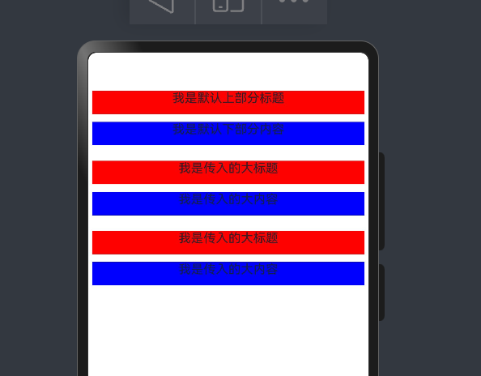

### 1.2状态管理--状态变量

#### 1.2.1   版本V1

###### 1.2.1@state

~~~ typescript
//本案例主要是讲@sstate的练习
import { CardType } from "@kit.VisionKit"

//表示@state的局限性
interface Car{
  name:string
}

interface penson{
  name:string,
  car:Car
}

@Entry
@Component
struct indexx {
  @State wenzi:string='张三'
  @State buNeng:penson={
    name:'李四',
    car:{name:'宝马x5'}//对象定义的时候不用等号，而是用冒号
  }
  build() {
    Column() {
      Text(this.wenzi)
      Button('点击修改名字为张四').onClick(()=>{
        this.wenzi='张四'
      })
      Text(this.buNeng.name)
      Button('点击修改名字为王五').onClick(()=>{
        this.buNeng.name='王五'
      })
      Text(this.buNeng.car.name)
      Button('点击修改车名为保时捷').onClick(()=>{
        this.buNeng.car={//对象的赋值还是用等号，要用大括号包起来
          name:'保时捷'
        }
      })
    }
  }
}
~~~

示例图

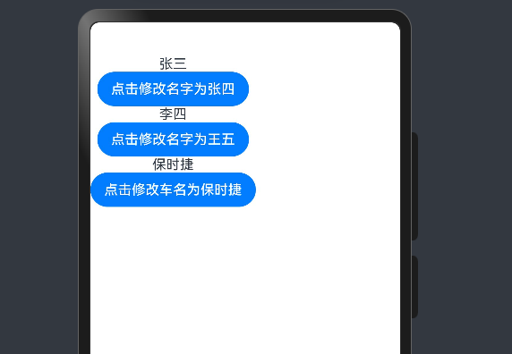

###### 1.2.1@prop

理论

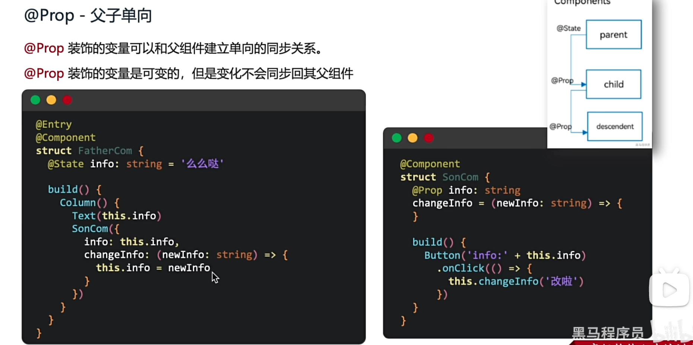

理解：父组件就是entry部分的组件，这里定义的是@state，然后子组件中，用@prop接受，（同步渲染，父变子也变）但是这个变量，子组件可以修改这个变量，但是不会同步到父组件中，父组件修改后，子组件的值就跟着变了。这就是@prop

实操

###### 1.2.1@link

理论

理解：经过@prop后，对于@link的理解是，子组件也可以修改这个值，然后父组件那边也会同步更新（？父组件用@state，子组件用@link）

实操：

###### 1.2.1@provide和consume

理论：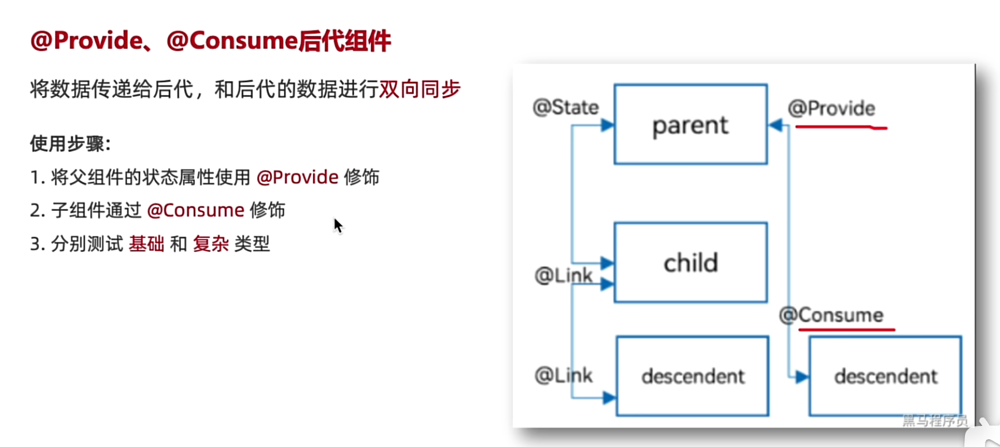

理解：父组件定义@provide，孙子那里也会同步，是双向的，也就是孙子也可以修改。在子组件的子组件中（定义@consume，这个时候可以接受最外层的@provide的值） 

实操：

###### 1.2.1@oberved和@objectLink

理论：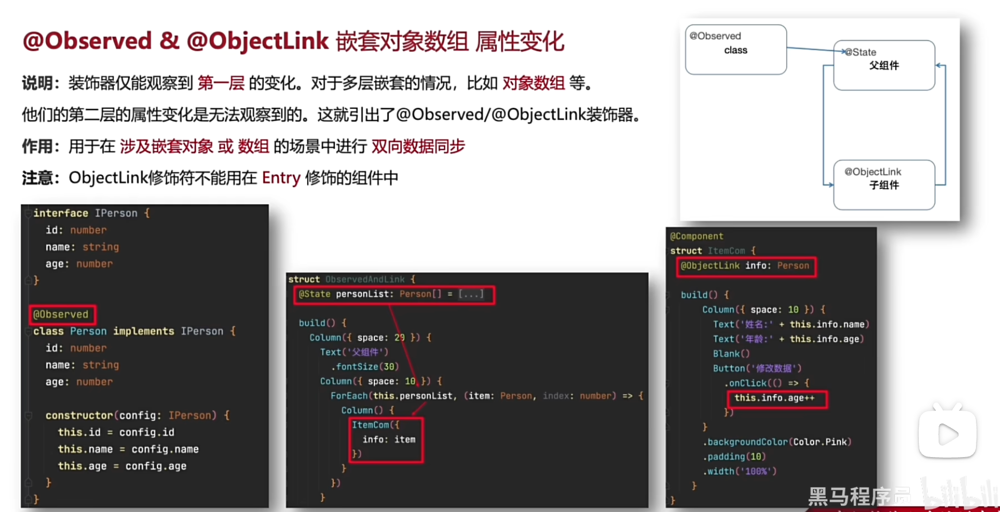

理解：这个是解决数组，多层嵌套无法直接使用修改里面的值的装饰器

 实操：

#### 1.2.2 版本V2

##### 1.2.2.1背景

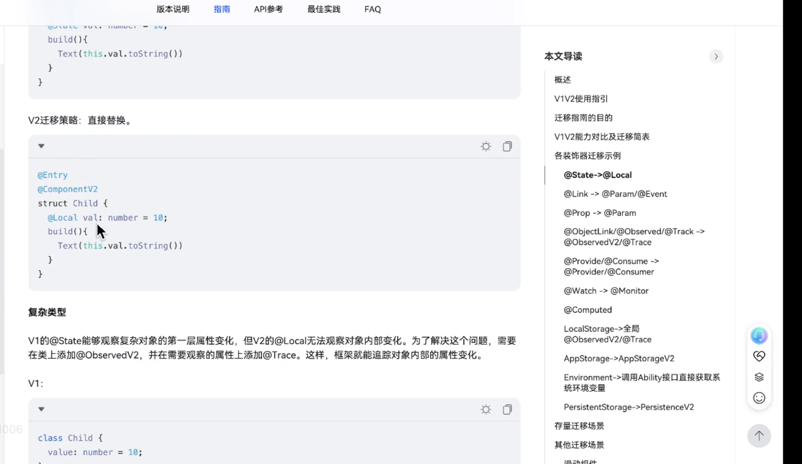

##### 1.2.2.2@observedV2和@Trace装饰器

@observedV2首先是什么？能够干嘛

给一个class装饰，可以监听这个class的属性

@trace是什么？

在这个class中有一些子属性，当想改变这某一个具体数值的时候，就在具体的数值前面加上@trace就行了

### 1.2布局

#### 1.2.1内外边距

内边距是padding，外边距是margin

##### 状态管理部分

